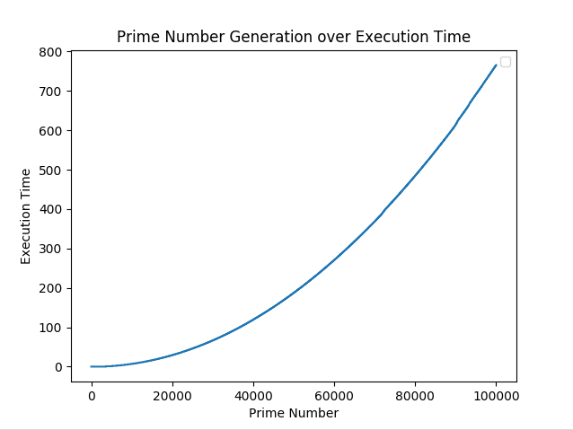

# primes.py
The #1 high cost, _low effiency_ method for turning electricity into something useful that you can use to _heat your own home!_



## About:
Data Science has always seemed cool, but it's pretty niche. After making a prime number generator, however, I realized graphing it would be a low-hanging fruit (read: <100 LOC) and an easy introductory project to try out Matplotlib and NumPy. 

Here's the algorithms for finding a prime number _i_, and all prime numbers less than _i_.
```python
def isPrime(i):
    prime = True
    for j in range(2, i):
        if (i % j == 0):
            prime = False
    return prime

def generateAllPrimes(i, datafile):
    startTime = time.time()
    f = open(datafile, "w")
    for j in range(i):
        if isPrime(j):
            executionTime = int(time.time() - startTime)
            f.write(str(j) + "," + str(executionTime) + "\n")
    f.close()

```


Rather than reinvent the wheel and write a progress function, check how the program is coming along with:

``` tail primes.csv ```

Not that it should be an issue, but you can also check the size of the data output with:

``` du -sh primes.csv ```


<!-- cse please hire :) --> 
